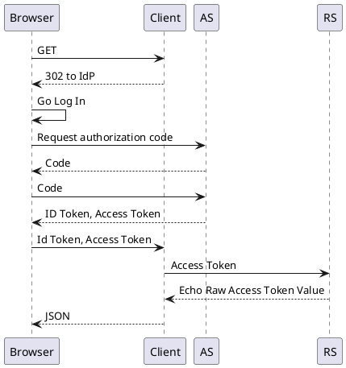

# OAuth2 Timing Demo

This project includes a single maven repository with two applications

- client
- rs (resource server)

### Requirements

You'll need jdk11.

## Running

### Linux/MacOS

```shell
./mvnw -pl rs spring-boot:run
```

```shell
./mvnw -pl client spring-boot:run
```

### Windows

```shell
mvnw.bat -pl rs spring-boot:run
```

```shell
mvnw.bat -pl client spring-boot:run
```

## How It Works




## Configuration

There are two application.yaml files. You'll need to fill in the `TODO` values for issuer-uri, client-id, client-secret

- [rs](rs/src/main/resources/application.yaml)
- [client](client/src/main/resources/application.yaml)

The configuration assumes that you are using the OIDC Authorization
Code grant flow to obtain your token. You'll need a client-id and
client-secret. You might be able to get away without a client-secret
using PKCE (I haven't tried it).

## Related Links

* [Spring Boot 2.7.5](https://docs.spring.io/spring-boot/docs/2.7.5/reference/htmlsingle/)
* [Spring WebFlux Authorized Clients](https://docs.spring.io/spring-security/reference/5.7.4/reactive/oauth2/client/index.html)
* [Spring WebFlux Security](https://docs.spring.io/spring-security/reference/5.7.4/reactive/configuration/webflux.html)
* [OAuth Grant Explainer](https://alexbilbie.com/guide-to-oauth-2-grants/)