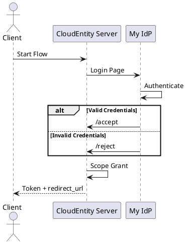
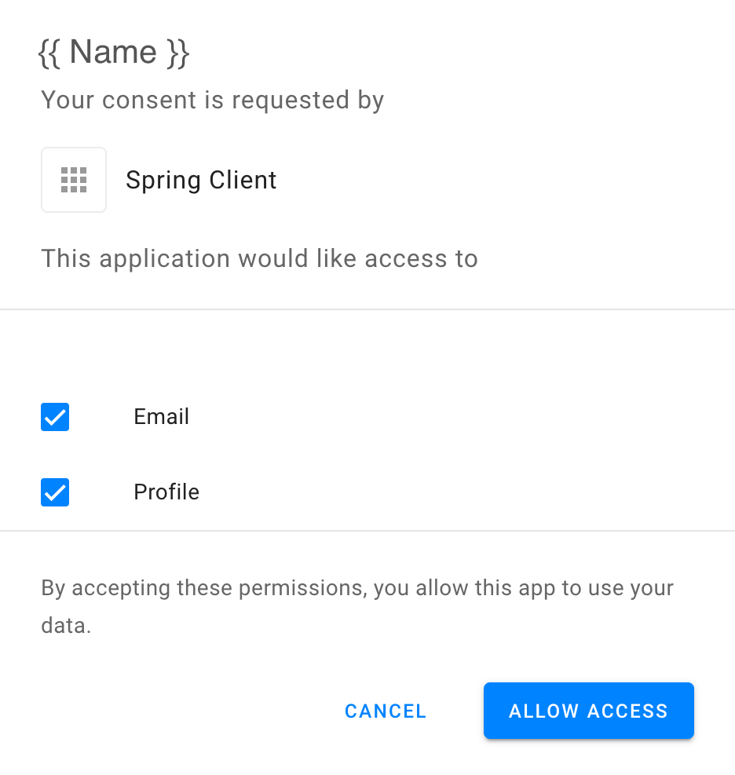

# Spring Boot Custom Identity Provider

Dummy IdP to verify we can hack our legacy authentication into a modern
auth flow using CloudEntity.


## Simplified Flow



A user in a browser will experience this as:

1. Visit an app, get redirected to CE Login Screen.
2. Pick login method (e.g. Login With Google, Facebook, or My IdP).
3. Enter credentials on login screen.
4. Get redirected back to CloudEntity.
5. Pick [Consents](#consent).
6. Get redirected back to original app.

See [Custom IdP] for details.

## Configuration

### Register Custom IdP in ACP

You'll need to add an **Identity Provider** in ACP. This will be a **Custom IDP**. When prompted, the Login URL will be

```text
http://localhost:8888/login
```

### application.properties

Create a `src/main/resources/application.properties` (which is .gitignore'd to keep you from checking it in).

```properties
## http server port
server.port=8080
## Tenant ID can be recognized from your tenant's url, e.g. {{tenant-id}}.us.authz.cloudentity.io
cloudentity.tenant-id=
# Keep cloudentity.registration-id set to "cloudentity" unless you know what you are doing.
# and will be tied to your _system_ workspace.
spring.security.oauth2.client.registration.cloudentity.client-id=
spring.security.oauth2.client.registration.cloudentity.client-secret=
# Keep provider set to "cloudentity" unless you know what you are doing.
spring.security.oauth2.client.registration.cloudentity.provider=cloudentity
spring.security.oauth2.client.registration.cloudentity.client-authentication-method=client_secret_basic
spring.security.oauth2.client.registration.cloudentity.authorization-grant-type=client_credentials
spring.security.oauth2.client.provider.cloudentity.issuer-uri=https://${cloudentity.tenant-id}.us.authz.cloudentity.io/${cloudentity.tenant-id}/system
## Logging
logging.level.reactor.netty.http.client=debug
logging.level.com.example=trace
```

## Running

We're expecting Java 17 (a capricious choice, you can easily make this work in Java 8).

```shell
./mvnw spring-boot:run
```

You'll need a client app to perform a redirect to get you valid
`login_id` and `login_state` values on the login page. The default demo app
in the workspace should suffice.

## Consent Screen

<a name="consent"></a>
You'll need to map an attribute into the "Name" field in order to get sane output on the
Consent screen.



## Links

- [Custom IdP]

[Custom IdP]: (https://cloudentity.com/developers/howtos/identities/custom-idp/)